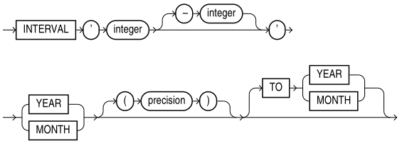
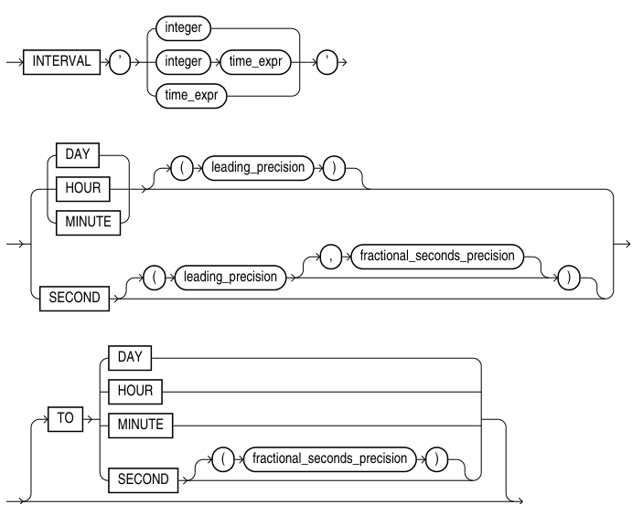

# interval 数据类型

[TOC]

## YEAR TO MONTH



- integer: 首个和可选的末尾字段的整型值。如果首个字段是 YEAR, 末尾字段是 MONTH, 那么月份字段的范围是0到11

- precision: 首个字段中数字的最大数量，范围是0到9，默认是2

注意：只能是 YEAR TO MONTH, 不能是 MONTH TO YEAR

```sql
-- 123年 2个月 
SQL> select interval '123-2' year(3) to month from dual;

INTERVAL'123-2'YEAR(3)TOMONTH
--------------------------------------------------------------------------------
+123-02

SQL> select interval '123-2' year(2) to month from dual;
select interval '123-2' year(2) to month from dual

ORA-01873: 间隔的前导精度太小

SQL> select interval '123-2' year(4) to month from dual;

INTERVAL'123-2'YEAR(4)TOMONTH
--------------------------------------------------------------------------------
+0123-02

-- 123年 0个月 
SQL> select interval '123' year(3) from dual;

INTERVAL'123'YEAR(3)
--------------------------------------------------------------------------------
+123-00

SQL> select interval '123' year(4) from dual;

INTERVAL'123'YEAR(4)
--------------------------------------------------------------------------------
+0123-00

-- precision默认是2
SQL> select interval '123' year from dual;
select interval '123' year from dual

ORA-01873: 间隔的前导精度太小

SQL> select interval '4' year from dual;

INTERVAL'4'YEAR
--------------------------------------------------------------------------------
+04-00


SQL> select interval '300' month(3) from dual;

INTERVAL'300'MONTH(3)
--------------------------------------------------------------------------------
+025-00

SQL> select interval '50' month from dual;

INTERVAL'50'MONTH
--------------------------------------------------------------------------------
+04-02

SQL> select interval '5-3' year to month + interval '20' month from dual;

INTERVAL'5-3'YEARTOMONTH+INTERVAL'20'MONTH
--------------------------------------------------------------------------------
+000000006-11
```

## DAY TO SECOND



- integer: 天数

- time_expr: 以 `HH[:MI[:SS[.n]]]` 或 `MI[:SS[.n]]` 或 `SS[.n]` 格式指定一个时间，其中 n 是秒的小数位

- leading_precision: 首个字段的数字的数量。值范围是0到9，默认是2

- fractional_second_precision: 秒的数字的数量。值范围是1到9，默认是6

注意：只能是 DAY TO SECOND, 不能是 SECOND TO DAY，其他字段同理。

末尾字段的有效值范围：

- hour: 0-23
- minute: 0-59
- second: 0-59.999999999

```sql
-- 4天 5小时 12分钟 10秒 222千分之一秒
SQL> select interval '4 5:12:10.222' day to second(3) from dual;

INTERVAL'45:12:10.222'DAYTOSECOND(3)
--------------------------------------------------------------------------------
+04 05:12:10.222

SQL> select interval '4 5:12:10.222' day to second(4) from dual;

INTERVAL'45:12:10.222'DAYTOSECOND(4)
--------------------------------------------------------------------------------
+04 05:12:10.2220

SQL> select interval '4 5:12:10.222' day to second(2) from dual;

INTERVAL'45:12:10.222'DAYTOSECOND(2)
--------------------------------------------------------------------------------
+04 05:12:10.22

-- 10小时22分钟
SQL> select interval '10:22' minute to second from dual;

INTERVAL'10:22'MINUTETOSECOND
--------------------------------------------------------------------------------
+00 00:10:22.000000

-- 22分钟
SQL> select interval '22' minute from dual;

INTERVAL'22'MINUTE
--------------------------------------------------------------------------------
+00 00:22:00

SQL> select INTERVAL'20' DAY - INTERVAL'240' HOUR from dual;

INTERVAL'20'DAY-INTERVAL'240'HOUR
--------------------------------------------------------------------------------
+000000010 00:00:00.000000000
```