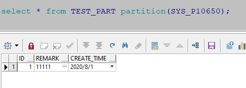

# oracle 自动分区

来自：[https://blog.csdn.net/dot_life/article/details/109376639](https://blog.csdn.net/dot_life/article/details/109376639)

1. 建表

```sql
create table test_part(
    ID NUMBER(20) not null,
    REMARK VARCHAR2(1000),
    CREATE_TIME DATE
)
tablespace test
    pctfree 10
    initrans 1
    maxtrans 255
    storage
    (
      initial 8M
      next 1M
      minextents 1
      maxextents unlimited
    )
PARTITION BY RANGE(CREATE_TIME)  
INTERVAL(numtoyminterval(1,'month'))  -- 按月分区
(partition part_t01 values less than(to_date('2020-08-01','yyyy-mm-dd')));
```

numtoyminterval 的用法见：[https://docs.oracle.com/cd/E11882_01/server.112/e41084/functions118.htm#SQLRF00683](https://docs.oracle.com/cd/E11882_01/server.112/e41084/functions118.htm#SQLRF00683)

查询当前表有多少分区

```sql
select * from user_tab_partitions where table_name='TEST_PART';
```


2. 插入数据

```sql
insert into test_part(ID,REMARK,create_time)values(4,'44444',to_date('2020-07-01','yyyy-mm-dd'));
insert into test_part(ID,REMARK,create_time)values(1,'11111',to_date('2020-08-01','yyyy-mm-dd'));
insert into test_part(ID,REMARK,create_time)values(2,'22222',to_date('2020-09-01','yyyy-mm-dd'));
insert into test_part(ID,REMARK,create_time)values(3,'22222',to_date('2020-10-01','yyyy-mm-dd'));
commit;
```

查询当前表有多少分区

```sql
select * from user_tab_partitions where table_name='TEST_PART';
```


3. 查看单独分区数据

```sql
select * from TEST_PART partition(SYS_P10650);
```




