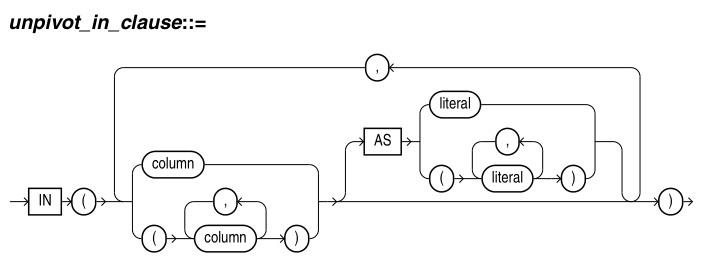

# PIVOT 和 UNPIVOT

[TOC]

## 准备数据

```sql
create table demo0426(name varchar(20), subject varchar(20), scores int); 
insert into demo values('zhangsan','A',50);
insert into demo values('lisi', 'A', 70);
insert into demo values('wangwu', 'A', 80);
insert into demo values('zhangsan','B',90);
insert into demo values('lisi', 'B', 60);
insert into demo values('wangwu', 'B', 80);
insert into demo values('zhangsan','C',70);
insert into demo values('lisi', 'C', 80);
insert into demo values('wangwu', 'C', 60);

SQL> select * from demo0426;

NAME                 SUBJECT                                               SCORES
-------------------- -------------------- ---------------------------------------
zhangsan             A                                                         50
lisi                 A                                                         70
wangwu               A                                                         80
zhangsan             B                                                         90
lisi                 B                                                         60
wangwu               B                                                         80
zhangsan             C                                                         70
lisi                 C                                                         80
wangwu               C                                                         60
```

## PIVOT

**query_table_expression pivot_clause**


- pivot (aggregate_function(expr) as alias pivot_for_clause pivot_in_clause)


行转列，在转换的同时，聚合数据。转换后的结果具有更多的列、更少的行。

处理逻辑：

- 执行子句开头的聚合函数。此时，会有一个隐式的分组操作，隐式分组基于没有在 pivot_clause 中引用的列，以及在 pivot_in_clause 中指定的值。 

- 输出结果

	- 没有在 pivot_clause 中引用的所有隐式分组列（下例中的SUBJECT字段）
	- 紧随其后的是，pivot_in_clause 子句中指定的新列（下例中的zhangsan、lisi、wangwu字段）。每个聚合值放到合适的新列中。

```sql
SQL> select * from demo0426 pivot (sum(scores) as ss for name in ('zhangsan' as zhangsan,'lisi' as lisi,'wangwu' as wangwu));

SUBJECT              ZHANGSAN_SS    LISI_SS  WANGWU_SS
-------------------- ----------- ---------- ----------
B                             90         60         80
C                             70         80         60
A                             50         70         80

SQL> select * from demo0426 pivot (sum(scores) for name in ('zhangsan' as zhangsan,'lisi' as lisi,'wangwu' as wangwu));

SUBJECT                ZHANGSAN       LISI     WANGWU
-------------------- ---------- ---------- ----------
B                            90         60         80
C                            70         80         60
A                            50         70         80

SQL> select * from demo0426 pivot (sum(scores) as ss for name in ('zhangsan' ,'lisi' ,'wangwu' ));

SUBJECT              'zhangsan'_SS  'lisi'_SS 'wangwu'_SS
-------------------- ------------- ---------- -----------
B                               90         60          80
C                               70         80          60
A                               50         70          80
```

subquery 和 any 都和 XML 关键词一起使用。

## UNPIVOT

**query_table_expression unpivot_clause**


- unpivot (column pivot_for_clause unpivot_in_clause) 



列转行。

- include nulls | exclude nulls:

	- include nulls: 使 unpivot 操作包含 null 值行
	- exclude nulls: 使 unpivot 操作不包含 null 值行。默认选项

- column: 指定输出列的名字，该列持有度量值

- pivot_for_clause: 指定输出列的名字，该列持有描述符值

- unpivot_in_clause: 指定输入数据列，它的名字将成为 pivot_for_clause 的输出列的值。

	- 可选的 AS 子句可以将输入数据列名映射到输出列中指定的 literal 值

```sql
SQL> create table pivot_tb as select * from demo0426 pivot (sum(scores) for name in ('zhangsan' as zhangsan,'lisi' as lisi,'wangwu' as wangwu));

Table created


SQL> select * from pivot_tb;

SUBJECT                ZHANGSAN       LISI     WANGWU
-------------------- ---------- ---------- ----------
B                            90         60         80
C                            70         80         60
A                            50         70         80

SQL> select * from pivot_tb unpivot (scores for name in (zhangsan as 'zhangsan', lisi as 'lisi', wangwu as 'wangwu'));

SUBJECT              NAME         SCORES
-------------------- -------- ----------
B                    zhangsan         90
B                    lisi             60
B                    wangwu           80
C                    zhangsan         70
C                    lisi             80
C                    wangwu           60
A                    zhangsan         50
A                    lisi             70
A                    wangwu           80
```