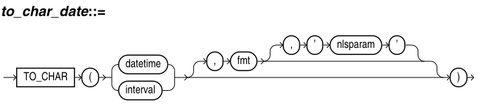
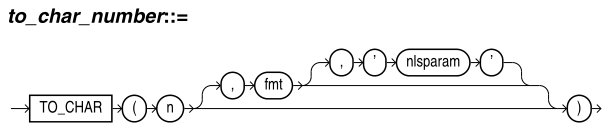

# TO_CHAR

[TOC]

## TO_CHAR(datetime)



把 datetime 或 interval 值转成 fmt 格式的 VARCHAR2 类型。

如果忽略了 fmt 参数：

- DATE 转成默认的日期格式
- TIMESTAMP 和 TIMESTAMP WITH LOCAL TIME ZONE 转成默认的时间戳格式
- TIMESTAMP WITH TIME ZONE 转成默认的时间戳格式，含时区
- INTERVAL DAY TO SECOND 和 INTERVAL YEAR TO MONTH 转成 interval 字面量的数值表示

```sql
CREATE TABLE date_tab (
ts_col TIMESTAMP,
tsltz_col TIMESTAMP WITH LOCAL TIME ZONE,
tstz_col TIMESTAMP WITH TIME ZONE
);

ALTER SESSION SET TIME_ZONE = '-8:00';

INSERT INTO date_tab VALUES (
TIMESTAMP'1999-12-01 10:00:00',
TIMESTAMP'1999-12-01 10:00:00',
TIMESTAMP'1999-12-01 10:00:00');

INSERT INTO date_tab VALUES (
TIMESTAMP'1999-12-02 10:00:00 -8:00',
TIMESTAMP'1999-12-02 10:00:00 -8:00',
TIMESTAMP'1999-12-02 10:00:00 -8:00');

SQL> select sessiontimezone from dual;

SESSIONTIMEZONE
------------------------------------------------
-08:00

SQL> select * from date_tab;

TS_COL                           TSLTZ_COL                             TSTZ_COL
-------------------------------- ------------------------------------- ------------------------------------------
01-12月-99 10.00.00.000000 上午   01-12月-99 10.00.00.000000 上午       01-12月-99 10.00.00.000000 上午 -08:00
02-12月-99 10.00.00.000000 上午   02-12月-99 10.00.00.000000 上午       02-12月-99 10.00.00.000000 上午 -08:00
```

```sql
SQL> select to_char(ts_col, 'DD-MON-YYYY HH24:MI:SSxFF') as ts_date,
  2         to_char(tstz_col, 'DD-MON-YYYY HH24:MI:SSxFF TZH:TZM') as tstz_date
  3  from date_tab
  4  order by ts_date, tstz_date;

TS_DATE                             TSTZ_DATE
----------------------------------- ------------------------------------------
01-12月-1999 10:00:00.000000        01-12月-1999 10:00:00.000000 -08:00
02-12月-1999 10:00:00.000000        02-12月-1999 10:00:00.000000 -08:00


SQL> select sessiontimezone,
  2         to_char(tsltz_col, 'DD-MON-YYYY HH24:MI:SSxFF') as tsltz
  3  from date_tab
  4  order by sessiontimezone, tsltz;

SESSIONTIMEZONE                                                             TSLTZ
---------------------------------------------- -----------------------------------
-08:00                                         01-12月-1999 10:00:00.000000
-08:00                                         02-12月-1999 10:00:00.000000
```

修改时区后，会发现 TIMESTAMP WITH LOCAL TIME ZONE 会受会话时区影响，而 TIMESTAMP 和 TIMESTAMP WITH TIME ZONE 不受会话时区影响

```sql
ALTER SESSION SET TIME_ZONE = '-5:00';

SQL> select to_char(ts_col, 'DD-MON-YYYY HH24:MI:SSxFF') as ts_date,
  2         to_char(tstz_col, 'DD-MON-YYYY HH24:MI:SSxFF TZH:TZM') as tstz_date
  3  from date_tab
  4  order by ts_date, tstz_date;

TS_DATE                             TSTZ_DATE
----------------------------------- ------------------------------------------
01-12月-1999 10:00:00.000000        01-12月-1999 10:00:00.000000 -08:00
02-12月-1999 10:00:00.000000        02-12月-1999 10:00:00.000000 -08:00

SQL> 
SQL> select sessiontimezone,
  2         to_char(tsltz_col, 'DD-MON-YYYY HH24:MI:SSxFF') as tsltz
  3  from date_tab
  4  order by sessiontimezone, tsltz;

SESSIONTIMEZONE                                                             TSLTZ
--------------------------------------------------------------------------- -----------------------------------
-05:00                                                                      01-12月-1999 13:00:00.000000
-05:00                                                                      02-12月-1999 13:00:00.000000
```

```sql
SQL> select to_char(interval '123-2' year(3) to month) from dual;

TO_CHAR(INTERVAL'123-2'YEAR(3)TOMONTH)
--------------------------------------
+123-02
```

## TO_CHAR(number)



把 n 转成 VARVHAR2 数据类型的值，使用 fmt 指定格式。

如果忽略了 fmt 参数，那么 n 转成正好能包含数字的 VARVHAR2 值。

如果 n 是负数，那么应用格式后，就要使用符号。例如 TO_CHAR(-1, '$9') 返回 -$1 而不是 $-1

```sql
SQL> select to_char('01110') from dual;

TO_CHAR('01110')
----------------
01110

-- 使用了隐式转换，将字符串转成了数字
SQL> select to_char('01110'+1) from dual;

TO_CHAR('01110'+1)
------------------
1111


SQL> select to_char(-10000, 'L99G999D99MI') from dual;

TO_CHAR(-10000,'L99G999D99MI')
------------------------------
       ￥10,000.00-


SQL> select to_char(-1,'$9') from dual;

TO_CHAR(-1,'$9')
----------------
-$1


SQL> SELECT TO_CHAR(-10000,'L99G999D99MI','NLS_NUMERIC_CHARACTERS = '',.'' NLS_CURRENCY = ''AusDollars'' ') "Amount" FROM DUAL;

Amount
--------------------
AusDollars10.000,00-
```