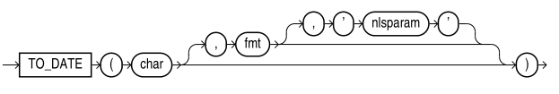

# TO_DATE



把 char 转成 DATE 数据类型的值，而不会将数据转成其他 datetime 数据类型。

不要将 DATE 类型的值指定为参数 char.

```sql
SQL> SELECT TO_DATE('1999-10-20','YYYY-MM-DD') FROM DUAL;

TO_DATE('1999-10-20','YYYY-MM-DD')
----------------------------------
1999/10/20
``` 

如果忽略 fmt, char 必须是默认的日期格式，不过最好指定。默认的日期格式由 NLS_TERRITORY(默认CHINA) 隐式决定，或者由 NLS_DATE_FORMAT(默认DD-MON-RR) 明确设置。

```sql
SQL> ALTER SESSION SET NLS_DATE_FORMAT='YYYY-MM-DD';

Session altered

SQL> SELECT TO_DATE('1999-10-20') FROM DUAL;

TO_DATE('1999-10-20')
---------------------
1999/10/20
```