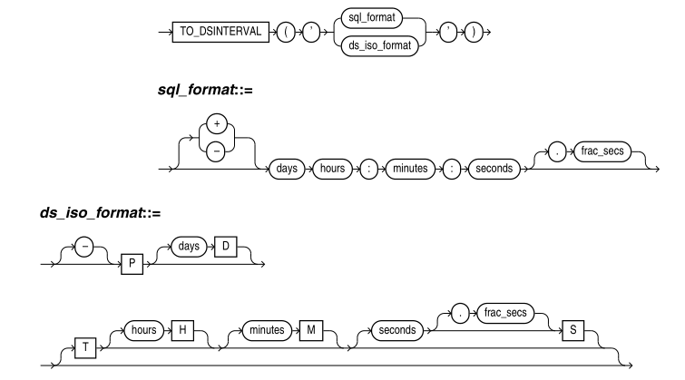
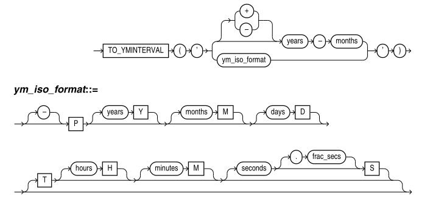

# TO_DSINTERVAL 和 TO_YMINTERVAL

[TOC]

## TO_DSINTERVAL 



将 CHAR\VARCHAR2\NCHAR\NVARCHAR2 数据类型转成 INTERVAL DAY TO SECOND 类型。

接收以下两种格式的参数：

- sql_format: 兼容 SQL 标准(ISO/IEC 9075:2003)

	- days: 0到999999999的整型
	- hours: 0到23的整型
	- minutes和seconds: 0到59的整型
	- frac_secs: 秒的小数部分，范围是 .0 到 .999999999

	一个或多个空格划分开 days 和 hours

- ds_iso_format: 兼容 SQL 8601:2004 标准

	- days hours minutes seconds: 0到999999999的整型
	- frac_secs: 秒的小数部分，范围是 .0 到 .999999999 

	参数中不允许存在空格。如果指定了T, 那么必须指定至少一个 hours minutes seconds 值。

```sql
SQL> select date '2020-01-01' + to_dsinterval('2 00:00:00') from dual;

DATE'2020-01-01'+TO_DSINTERVAL('200:00:00')
-------------------------------------------
2020/1/3

SQL> select timestamp '2020-01-01 12:12:12' + to_dsinterval('2 10:00:00.3') from dual;

TIMESTAMP'2020-01-0112:12:12'+TO_DSINTERVAL('210:00:00.3')
--------------------------------------------------------------------------------
03-1月 -20 10.12.12.300000000 下午

SQL> select timestamp '2020-01-01 08:12:12' + to_dsinterval('P2DT02H02M') from dual;

TIMESTAMP'2020-01-0108:12:12'+TO_DSINTERVAL('P2DT02H02M')
--------------------------------------------------------------------------------
03-1月 -20 10.14.12.000000000 上午
```

## TO_YMINTERVAL



将 CHAR\VARCHAR2\NCHAR\NVARCHAR2 数据类型转成 INTERVAL YEAR TO MONTH 类型。

接收以下两种格式的参数：

- sql_format: 兼容 SQL 标准(ISO/IEC 9075:2003)

	- years: 0到999999999的整型
	- months: 0到11的整型

- ds_iso_format: 兼容 SQL 8601:2004 标准

	- years months: 0到999999999的整型
	- days hours minutes seconds frac_secs: 非负整型，如果指定了，就会被忽略。

	参数中不允许存在空格。如果指定了T, 那么必须指定至少一个 hours minutes seconds 值。

```sql
SQL> select date '2020-01-01' + to_yminterval('01-01') from dual;

DATE'2020-01-01'+TO_YMINTERVAL('01-01')
---------------------------------------
2021/2/1

SQL> select date '2020-01-01' + to_yminterval('P1Y1M') from dual;

DATE'2020-01-01'+TO_YMINTERVAL('P1Y1M')
---------------------------------------
2021/2/1

```