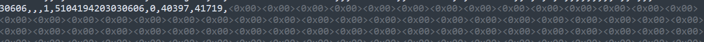

# 问题汇总

[TOC]

### 问题1

使用 sqlloader 往 oracle 中导入百万条数据时，报错： 

- `SQL*Loader-510:  数据文件中物理记录超过最大限制 (20971520)`

- `ORA-01841 ：（完整）年份必须在-4713到+9999之间`

- `ora-01653 无法通过1024扩展`

出现前两个问题的原因都是数据源的问题。在数据源文件中，最后一行的最后一个字段，出现这种格式，且出现了上万行：

所以，可以在导数据的时候，把这个文件的这个部分，单独一行。再次导入的时候，指定使用 `options(load=100)` 导入的行数。

在解决这个问题的过程中，发现了相同的问题的不同解决办法，但无法解决上述问题：

[https://www.linuxidc.com/Linux/2012-02/54522.htm](https://www.linuxidc.com/Linux/2012-02/54522.htm)

[https://mlog.club/article/4802857](https://mlog.club/article/4802857)

第三个问题可以查看表空间是否已满，或表空间是否开启了自动扩展的功能。如何查看点击[这里](https://blog.csdn.net/xiaohaijiejie/article/details/80861092)。

这里是因为表空间已满，可以使用 `ALTER TABLESPACE test ADD DATAFILE 
'D:\oracle_tablespace\test\test_004.DBF’SIZE 1024M AUTOEXTEND ON NEXT 1024M MAXSIZE UNLIMITED;` 增加一个 DBF 文件。

### 问题2

使用 cx_Oracle 库远程连接 ORACLE，出现 `Cannot locate a 64-bit Oracle Client library` 错误。

解决：除了安装、配置 instantclient 外，还需要把 instantclient 目录下的 oci.dll、oraocci11.dll、oraociei11.dll 放到 python 的 Lib 下的 site-packages 下。同时注意版本一致。

### 问题3

使用 impdp 命令将 dmp 文件中的数据导入到数据库时，报错：

（1）dumpfile 参数不能添加路径

（2）要使用 `create directory` 命令创建 directory 参数值，然后再使用 。

